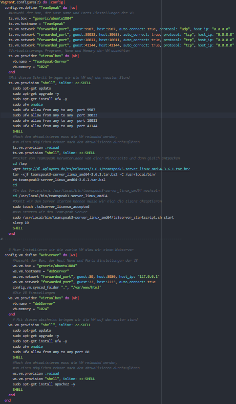
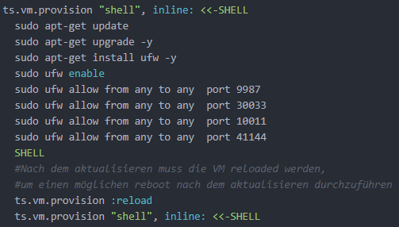
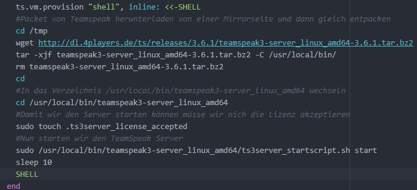
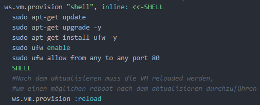
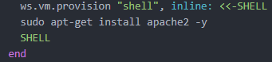
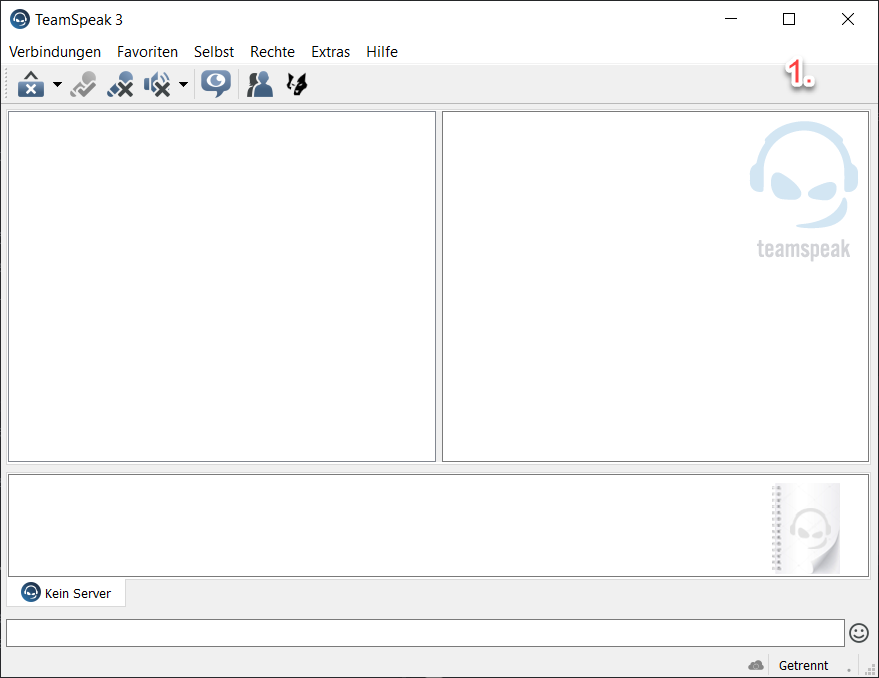
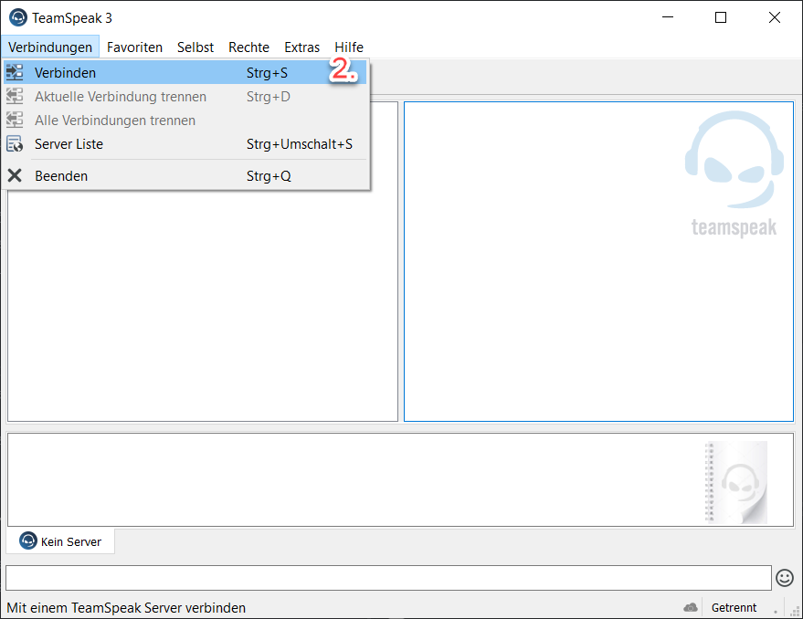
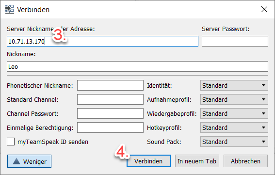
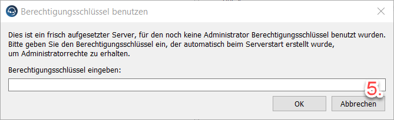
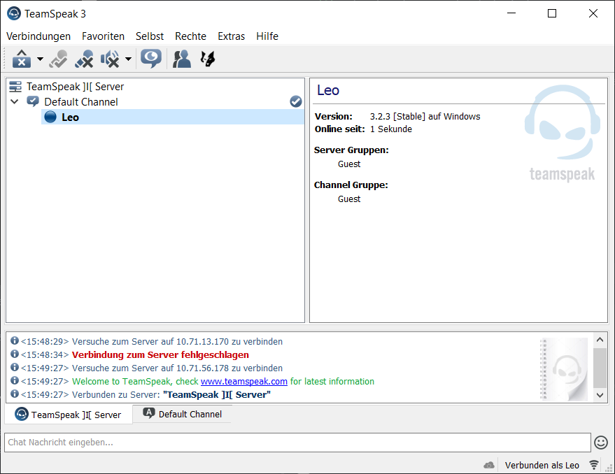

# LB01 von Leandro Götzer

## Auftrag
Unser Auftrag ist es, eine VM automatisiert aufzusetzten mit einem Vagrant File.
Dazu müssen wir Services aussuchen die wir installieren und konfigurieren mitels Vagrant File.

### Meine Idee für die LB01
Ich will zwei Server Aufsetzten.
Als erster Server dachte ich mir mache ich einen TeamSpeak Server.
Da ich TeamSpeak kenne, finde ich dies eine gute Idee.
Zudem will ich einen zweiten Server noch installieren.
Dabei dachte ich mir, dass ich mein TeamSpeak Server auf einer Webseite veröffentliche.
Dazu installiere ich einen Apache2 Server mit einer Webseite in der Infos von unserem TeamSpeak Server vorhanden sind.

### Informationen
[1]: https://docs.google.com/document/d/1M-aswL3k4uI-_MYO8RLX7ExAFEzVJkUoqjAOLj9gtyY/edit
[2]: https://guides.github.com/features/mastering-markdown/
[3]: https://bscw.tbz.ch/bscw/bscw.cgi/25833849
[4]: https://github.com/ask-yo-girl-about-me/M300-Services.git
[5]: https://wiki.ubuntuusers.de/TeamSpeak-Server/
[6]: https://wiki.ubuntuusers.de/Apache2/
[7]: https://www.teamspeak.com/en/

Alle Unterlagen befinden sich im [BSCW-M300][3] Folder. Noch mehr Informationen finden sie im [Lernjournal][1] vom M300.
Dieses Dokument wurde mit [Markdown][2] geschrieben

### Nützliche Links
* [TBZ][1]
* [Mastring Markdown][2]
* [BSCW][3]
* [Mein Repository][4]
* [TeamSpeak Installation][5]
* [Apache2][6]
* [TeamSpeak][7]

## Vorbereitung
---
Zuerst suchte ich mir meine Dienste aus die ich per Vagrant installieren will heraus.
Meine Idee war es einen Teamspeak Server und dazu einen Überwachungsserver zu installieren.
Ich Installierte beide Server zuerst manuell in Virtualbox, um zu schauen was man alles machen kann und ich weiss das es läuft.
Dan fand ich heraus, dass der Überwachungsserver zu schwierig im Vagrant wird, Darum wählte ich als zweiten Server einen Apache2 Server in dem Infos von unserem TeamSpeak Server enthalten sind.

Als Vorbereitung oder absicherung installierte ich den TeamSpeak und den Apache Server einmal manuell. Um zu sehen welche befehle ich alles brauche und auf was ich alles achten muss.

## Installation
---
Grundsätzlich machten ich die Installation nach der Seite Wiki.Ubuntuusers.de.

Aber es gab einige Stolpersteine:
 * Netzwerkeinstellungen damit man von einem anderen Gerät darauf zugreiffen kann.
 * Neustarten der VM wären dem ausführen der VM
 * Updaten der Server

Hier ein Bild meines Vagrant Files:

### Konfigurieren der VM (TeamSpeak)
Grundsätzlich baute ich die VM auf, indem ich:
* Der VM Name definierte
* Die Box die ich brauche
  Hier wählte ich ein einfaches Ubuntu mit der Version 18.04
* Der Hostname der VM
* Die Netzwerkeinstellungen in Virtualbox
  Hier ist wichtig, dass man den für den TeamSpeak Server den Port 9987, 30033, 10011§ und 41144 und für den Apache Server 80 zwingend NATet.
* Den Provider auswähle, also das Virtualisierungsprogramm
* Der Name der VM
* Anzahl RAM

### Installieren von TeamSpeak Server
Als erstes bringen wir den TeamSpeak Server auf den neusten Stand. Dies machen wir per update und upgrade. Dazu Installieren und aktivieren wir nich die Firewall und nur die Ports die wir auch brauchen.

Wichtig ist hier, dass wir den Server neustarten, damit auch alles auf dem neusten stand läuft.
Danach Installieren wir TeamSpeak wie in der Anleitung beschrieben [TeamSpeak Installation][5].

Der letzte Punkt vor dem Starten des Server, ist sehr wichtig. Dieser musste ich selber herausfinde, weil dies in der Anleitung anderst gemacht wird, bei mir aber so nicht geklappt hat.

### Installieren von WebServer
Als erstes bringen wir den Webserver auf den neusten Stand. Dies machen wir per update und upgrade.
Dazu Installieren und aktivieren wir nich die Firewall und nur die Ports die wir auch brauchen.
Wichtig ist hier das wir einen Neustart machen. Dies läuft über einen :reload. Dazu müssen wir aber zuerst etwas auf unserem Gerät Installieren.

Wichtig ist hier, dass wir den Server neustarten, damit auch alles auf dem neusten stand läuft.
Danach Installieren wir den Webserver wie in der Anleitung beschrieben [Apache2][6].

Hier hatte ich eigentlich keine grossen Probleme. Ausser, dass ich mich wieder ein bisschen ins HTML Codieren eindenken musste.

## Testing
---
Um das ganze zu testen, brauchen wir einen Internet explorer und TeamSpeak.

Den TeamSpeak können Sie entweder von der [TeamSpeak][7] Seite herunterladen oder von meinem Repo unter M300-Services/Vagrant/LB01/Software/TeamSpeakClient.

### TeamSpeak Testing
1. TeamSpeak Starten
2. Oben links auf Verbindungen
3. Verbinden
4. Server Adresse eingebem (in meinem Fall 10.71.13.13)
5. Verbinden
Hier einige Bilder

### WebServer Testing
1. Webbroswser öffnen
2. Server adresse mit Port in der Suche eingeben (10.71.13.13:8080)
